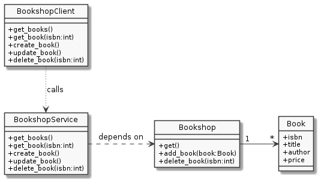

# ECM2429-workshop-6-exercises

Web API exercise

## RESTful services

A RESTful service is one where all interactions between client
and server are through HTTP messages.

These exchanges are always initiated by the client, and it is the client's responsibility to maintain the state of the exchange where required.  This means, for example, a client cannot ask for "the next item" from a list, as the server would not know what previous items, if any, had been sent.

## HTTP verbs

Web APIs do not typically implement persistent storage, but the HTTP verbs can be regarded as roughly equivalent to reading and writing data in files and databases.

HTTP supports four operations (or verbs) - Get, Post, Put and Delete. These are not unlike the four basic operations of databases - Create, Read, Update, and Delete.

| Operation | HTTP verb | SQL statement
|-----------|-----------|--------------|
| Create    | POST |  INSERT
| Read | GET | SELECT
| Update | PUT | UPDATE
| Delete | DELETE | DELETE

## Routing

Web APIs use URLs to identify resources, much as a web server sharing
documents will have a unique URL for each document.

When designing a web API we need to associate URLs with "end-points", that is the function, or method, to be called when a client sends a
message, called a request, to the server for this URL.  The server
will return a response message, containing either the data requested,
or details on any error.

## Bookshop example

Here is the routing information for the example in chapter 40 of J Hunt's Advanced Guide to Python 3 Programming.

Note that both **/book/** and **/book/&lt;isbn&gt;** have two different end-points.  A web server will determine end-points by both URL and HTTP verb.

| URL      | Verb(s) | End-point |
|----------|---------|-----------|
/book/list | GET | get_books()
/book/&lt;isbn&gt; | GET | get_book(isbn)
/book/ | POST | create_book()
/book/ | PUT | update_book()
/book/&lt;isbn&gt; | DELETE | delete_book()

## Python code

The code for this example is in [code/bookshop_service.py](code/bookshop_service.py)

Copied from <https://github.com/johnehunt/advancedpython3/tree/main/chapter39>

## UML diagram



## EXERCISE

1. Run the bookshop service on your PC.  You will need the Flask library. Use ```pip install flask```

 * You can do some initial tests with your web browser, e.g. visit <http://127.0.0.1:5000/book/list>

 * To make full use of the API you will need to write a client.

2. Design, and write a suitable client that can test all the API end-points.
